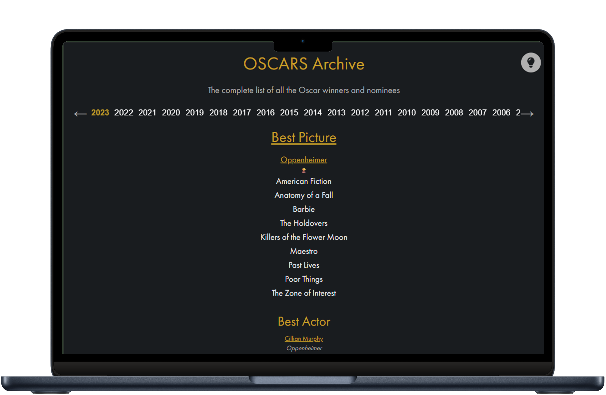

# Oscars Archive 

A simple Angular web app to browse all Academy Awards (Oscars) winners and nominations by year.

Instead of navigating through multiple Wikipedia pages, this tool lets you directly select a year and view all categories in one place — winners and nominees included.  
It was born out of a personal need: I often watch a movie and wonder _“Did this win any Oscars?”_  
Looking it up on Wikipedia usually means going through several links to find the right edition and then the right category. This app makes that process faster and more intuitive.

🔗 **Live site**: [oscars-archive.web.app](https://oscars-archive.web.app)

---

## Screenshot

  
<!-- Replace "screenshot.png" with your image file, or rename accordingly -->

---

## Features

- Instantly view Oscar winners and nominees for any year
- Clean and responsive UI
- Simple navigation from a single timeline view
- Choose on the top of the page your preference between Imdb and Letterboxd: clicking on any film title will open its page

---

## Tech Stack

- [Angular CLI](https://github.com/angular/angular-cli) version 18.2.8.
- Hosted on [Firebase](https://firebase.google.com/)

---

## Data Source

This project uses data from:  
📁 [oscar_data](https:github.com/DLu/oscar_data) by [@DLu](https://github.com/DLu/oscar_data)
https://github.com/DLu/oscar_data

---

## Getting Started

To run the project locally:

```bash
git clone https://github.com/stefanozugni/oscars.git
cd oscars
npm install
ng serve
```

Then open http://localhost:4200 in your browser.
